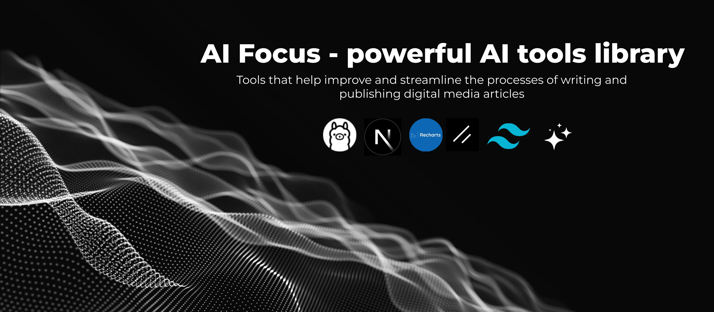

<a href="https://aifocus.sh/">
  
  <h1 align="center">AIfocus.sh - AI tools library</h1>
</a>

<p align="center">
  Un stack de herramientas con IA que te ayuden a generar contenido para redes sociales. Entre sus herramientas estan: Creacion de hilos de twitter/X, creacion de articulos, mejora de seo meta tags, creacion de graficos utilizando Shadcn y Recharts, entre otras herramientas...
</p>

<p align="center">
  <a href="#features"><strong>Features</strong></a> ·
  <a href="#model-providers"><strong>Model Providers</strong></a> ·
  <a href="#getting-started"><strong>Getting Started</strong></a> ·
  <a href="#conclusions"><strong>Conclusions</strong></a> ·
  <a href="#authors"><strong>Authors</strong></a>
</p>
<br/>

## Features

- [Next.js](https://nextjs.org) App Router
- React Server Components (RSCs), Suspense, and Server Actions
- [Vercel AI SDK](https://sdk.vercel.ai/docs) for streaming chat UI
- [Ollama](https://ollama.com/)
- [Llama3](https://ollama.com/library/llama3)
- [Llama3.1](https://ollama.com/library/llama3.1)
- [Recharts](https://recharts.org/en-US/) for chart generation
- [React Hook Form](https://react-hook-form.com/get-started)
- [shadcn/ui](https://ui.shadcn.com)
  - Styling with [Tailwind CSS](https://tailwindcss.com)
  - [Radix UI](https://radix-ui.com) for headless component primitives
  - Icons from [Lucide](https://lucide.dev/icons/)


## Model Providers

Este template utiliza con Llama3 y llama3.1 por defecto. Sin embargo, gracias al [Vercel AI SDK](https://sdk.vercel.ai/docs), puedes cambiar los proveedores LLM a [Anthropic](https://anthropic.com), [Cohere](https://cohere.com/), [Hugging Face](https://huggingface.co), o usar [LangChain](https://js.langchain.com) con sólo unas pocas líneas de código.

## Getting Started


First, install dependencies:

```bash
npm i
```

Install ollama in your computer:

[Install ollama](https://ollama.com/download)

Pull the model:

```bash
ollama pull llama3.1
```

Export the variable or copy .env.local:

```bash
export OLLAMA_BASE_URL="http://localhost:11434/api"
export OLLAMA_MODEL="<llama-model>"
```

Run the development server:

```bash
npm run dev
# or
yarn dev
# or
pnpm dev
# or
bun dev
```

## Conclusions
Fue un reto bastante interesante, descubri muchas cosas por primera vez y me sorprendio mucho la facilidad con la que alguien puede crear su propia herramienta de AI, utilizando [Vercel AI SDK](https://sdk.vercel.ai/docs) cualquiera puede construir y servir su modelo al publico. Aunque claro, siento que aun le hace falta trabajo al SDK ai, el `experimental_useObject` falla muchas veces y claro, entiendo que aun esta de forma experimental o beta. Tambien seria bueno que pudiese tener un refetch, eso ayudaria a refrescar resultados evitando asi `submit()`

Ejecutarlo en CPU ha sido todo un problema, a pesar de tener un cercer con 16 cores, 64 de ram y utilizando solo el modelo de 4GB htop indica que el procesador esta trabajando a tope con un solo request, eso inutiliza la aplicacion web, es una pena, si tienes gpu te recomiendo mejor descargarlo y probarlo en local...

La parte mas dificil fue parar, por eso creo que pude crear varios ejemplos de uso, espero que este proyecto le sirva a alguien. Si quiesieras participar o continuar con esta idea te dejo aqui mi twitter ([@iandres_montes](https://twitter.com/iandres_montes))

## To-do
No creo que siga el proyecto con la misma frecuencia con la que lo tenia, pero seguro lo haria poco a poco, es por eso que hay esta lista de cosas por hacer.
- Restrincion de tokens para sesiones
- Registro y login del usuario
- Tengo la idea de poner a prueba el modelo creando un blog y haciendo que el sea quien genere el contenido, podria ser bueno para el publico ver los resultados de ese trabajo, como por ejemplo: posicionamiento, numero de visitas, ranking en keywords, etc.
- Mejorar los prompts en las apis, no soy el mejor para este trabajo... que poca paciencia.
- Crear un modelo preentrenado quiza utilizando informacion especifica como la documentacion de tailwind o shadai para la generacion de charts
- Obtener imagenes desde pixabay u otro proveedor parecido
- Crear reels el script lo genera el modelo y describe las imagenes o videos que necesita, las imagenes y videos se traen desde pixabay y se puede utilizar esto para crear un video [VideoShow](https://github.com/h2non/videoshow)
- Acceso a api: nunca imagine esto como algo comercial, pero gusta la idea de ofrecerlo de forma gratuita, al menos el modelo 3.1 de llama o mistral no ocupa mucho espacio con 7 y 8 B. de parametros. Pero podria haber una version de paga y utilizar una integracion con GPT pero bueno... todo muy futuro 😂
- Historial de generacion

eso es lo que se me ocurre hasta ahora...

## Authors

- Iván Montes ([@iandres_montes](https://twitter.com/iandres_montes)) - [La Silla Vacía](https://www.lasillavacia.com/)
- Deimer Nuñez ([LinkedIn](https://www.linkedin.com/in/deimer-andres-nu%C3%B1ez-novoa-56212a181/))

